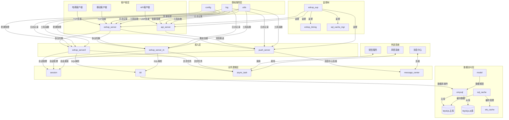

	# Erlang电商系统架构图

  

  

## 架构说明

  

### 1. 客户端层

- **电商客户端**：桌面端电商应用，通过TCP连接到主服务器

- **移动客户端**：移动端应用，通过TCP连接到主服务器

- **API客户端**：外部系统，通过UDP连接到API服务器

  

### 2. 接入层

- **eshop_server**：主服务器，处理客户端连接、握手认证和协议切换

- **eshop_server2**：处理主流协议客户端的业务请求

- **eshop_server_m**：处理移动客户端的业务请求

- **push_server**：处理实时推送通知，维护客户端长连接

- **api_server**：提供UDP API接口，支持外部系统调用

  

### 3. 业务逻辑层

- **session**：管理用户会话信息，维护在线状态

- **tdi**：处理客户端SQL查询请求，解析和执行SQL

- **async_task**：处理异步任务，如短信发送、风控接口调用

- **message_center**：连接外部消息中心，处理消息推送

  

### 4. 数据访问层

- **emysql**：MySQL数据库连接池，管理数据库连接

- **model**：数据模型层，封装数据库操作

- **sql_cache**：SQL缓存管理，提高查询性能

- **ets_cache**：基于ETS的内存缓存

- **MySQL主库**：主要的数据库，处理写操作

- **MySQL从库**：从数据库，处理读操作，实现读写分离

  

### 5. 基础服务层

- **config**：配置管理，加载和管理系统配置

- **log**：日志系统，记录系统运行日志

- **utils**：工具函数库，提供各种通用工具函数

  

### 6. 监督树

- **eshop_sup**：根监督进程，监督所有核心服务进程

- **eshop_timing**：定时任务服务器

- **sql_cache_mgr**：SQL缓存管理器

  

### 7. 外部系统

- **短信服务**：提供短信发送功能，用于验证码等

- **风控系统**：提供风险控制功能，用于登录风控等

- **消息中心**：外部消息中心，用于跨系统消息传递

  

## 核心流程

  

1. **客户端连接流程**：客户端 → eshop_server → 认证 → 协议切换 → eshop_server2/eshop_server_m → 登录 → 建立会话

  

2. **业务请求流程**：客户端 → eshop_server2/eshop_server_m → tdi解析 → 数据库操作 → 结果返回

  

3. **推送通知流程**：外部系统 → api_server → push_server → 客户端

  

4. **异步任务流程**：业务逻辑 → async_task → 外部系统 → 结果回调

  

## 技术特点

  

- **高并发**：基于Erlang/OTP平台，支持大量并发连接

- **容错设计**：监督树机制，自动重启失败进程

- **安全性**：RC4加密通信，多种认证方式

- **可扩展性**：模块化设计，支持水平扩展

- **高性能**：SQL缓存，主从数据库架构

  

## 部署建议

  

1. **核心服务**：部署在高可用服务器集群中

2. **数据库**：主从架构，主库用于写操作，从库用于读操作

3. **缓存**：使用分布式缓存系统，如Redis，提高缓存容量和可用性

4. **监控**：部署监控系统，实时监控系统运行状态

5. **日志**：集中式日志管理，便于日志分析和问题排查