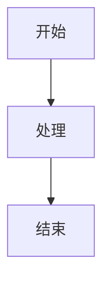
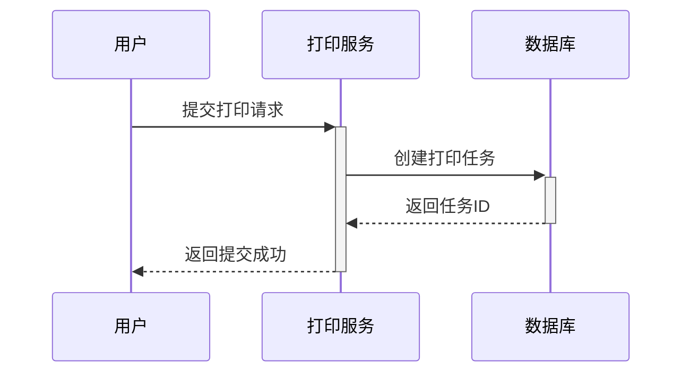

# 一级标签
## 二级标签
### 三级标签

**粗体**
*斜体*
~~删除线~~
- 列表1
- 列表2
- 列表3
1. 有序列表1
2. 有序列表2
3. 有序列表3

[这是一个连接](http://www.baidu.com)


```java
public class HelloWorld{{
	public static void main(String args[]){
		System.out.println("Hello, Obsidian!");
	}
}
```


[[c++项目编译.png]] #链接到另一个笔记


```java
// 支持语法高亮
@RestController
public class PrintController {
    @PostMapping("/print")
    public void print() {
        // 你的代码
    }
}
```

```sql
-- SQL 代码块
SELECT * FROM print_task 
WHERE status = 'PENDING';
```




行内公式：$E = mc^2$

块级公式：
$$
\int_{-\infty}^{\infty} e^{-x^2} dx = \sqrt{\pi}
$$

### 2. 标签系统
#技术/WMS
#技术/Java
#技术/数据库
#状态/进行中
#状态/已完成
#优先级/高

