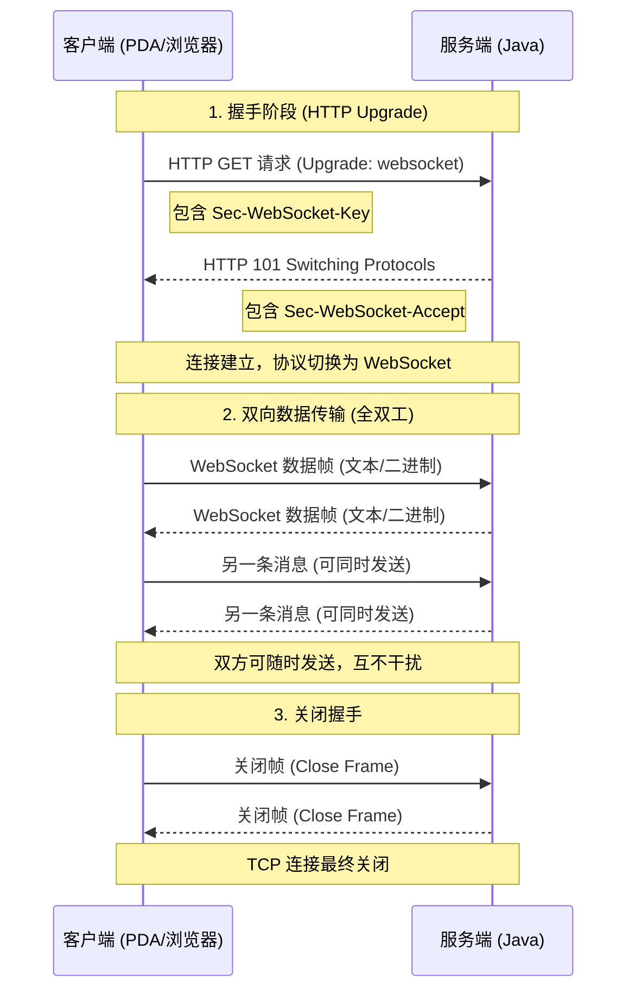

## websocket 和 http概述

http请求：客户端请求，服务器响应，无法主动向客户端推送数据（除非轮询或长轮询）

websocket：在客户端和服务器之间建立 **持久连接**，双方可以随时互相发送数据，非常适合实时通信（如设备状态上报、打印任务推送）。

## 一、为什么需要 WebSocket？

在传统的 Web 应用中，我们使用 HTTP 协议进行通信。HTTP 是**半双工**的：客户端发起请求，服务器才能响应。如果服务器想要主动给客户端推送数据，只能通过**轮询**或**长轮询**来实现。

- **轮询**：客户端每隔几秒发送一次请求，询问是否有新数据。这会导致大量无效请求，浪费带宽和服务器资源。
    
- **长轮询**：客户端发送请求后，服务器保持连接打开，直到有新数据或超时才返回。虽然减少了请求次数，但每个请求依然携带完整 HTTP 头部，且服务器需要维持大量挂起连接。

因此，需要一种能真正实现**服务器主动推送**且**低开销**的通信协议，WebSocket 应运而生。

## 二、WebSocket 简介

WebSocket 是一种**全双工**通信协议，它在客户端和服务器之间建立一个**持久连接**，双方可以随时互相发送数据。

- **协议标识**：`ws://`（非加密）或 `wss://`（加密，类似于 HTTPS）。
    
- **特点**：
    - 真正的全双工：客户端和服务器可以同时发送数据，互不干扰。
    - 轻量级：数据帧头部很小（2~14 字节），远小于 HTTP 头部。
    - 跨域友好：默认支持跨域通信。
    - 支持二进制：可以直接发送二进制数据（如图片、音频），无需 Base64 编码。

### WebSocket 如何工作？

1. **握手阶段**：客户端通过 HTTP 请求发起升级，服务器同意后，连接从 HTTP 切换到 WebSocket。
2. **数据传输**：之后双方通过同一个 TCP 连接发送数据帧，可以是文本或二进制。
3. **连接关闭**：任意一方可以主动发送关闭帧。





### websocket 的优点有哪些：

低延迟

- 连接一旦建立，后续数据传输无需再次握手，直接发送数据帧。帧头部仅 2~14 字节，远小于 HTTP 头部（几百字节）。
- 避免了轮询带来的间隔延迟，服务器有数据时可立即推送，实现真正的实时通信。

节省带宽和服务器资源

- 相比 HTTP 轮询（客户端频繁发送空请求），WebSocket 仅在传输数据时才占用带宽，空闲时连接保持但几乎无流量。
- 服务器无需为每个请求建立新连接，减少了 TCP 握手和 TLS 握手的开销，能支撑更多并发连接。

持久连接，状态保持

- 一次握手后，连接长期存在，双方可以在连接上维护会话状态（如用户登录信息），避免重复认证。
- 非常适合需要频繁交互的场景（如游戏、聊天、物联网设备控制）。

支持二进制数据传输
- WebSocket 可以发送二进制帧，直接传输图片、音频、视频或自定义协议数据，无需像 HTTP 那样进行 Base64 编码，效率更高。

 跨域友好
- WebSocket 协议本身支持跨域通信，只需服务器端配置允许的源即可，简化了跨域应用的开发。

应用层心跳保活

- 可在 WebSocket 基础上实现应用层心跳（如 Ping/Pong 帧），既能检测连接健康状态，又能防止中间设备（防火墙/NAT）因超时断开连接。

### 场景模拟：## 连接 PDA 与打印机

后端的 Java 服务能够与现场的 **PDA 设备**（便携数据采集器）进行实时通信，以便：

- PDA 上报扫描的条码、设备状态（电量、位置等）。
- 后端能够随时向 PDA 下发**打印任务**（比如打印一张标签）。

## 核心功能实现

### 1. 设备注册与管理

每个 PDA 连接后，必须先发送注册消息，携带唯一的 `deviceId`。服务端将其存入 `ConcurrentHashMap` 中，以便后续根据 ID 下发指令。

``` java
private void handleRegister(WebSocket conn, JsonNode data) {
    String deviceId = data.get("deviceId").asText();
    deviceConnections.put(deviceId, conn);
    conn.setAttachment(deviceId);
    sendResponse(conn, "register", "注册成功");
}
```

### 2. 心跳机制

为了防止连接被防火墙或 NAT 设备意外断开，客户端每隔 30 秒发送一次心跳消息。服务端收到后回复 `pong`，并更新该设备最后活跃时间（可选）。

``` java
private void handleHeartbeat(WebSocket conn, JsonNode data) {
    sendResponse(conn, "heartbeat", "pong");
}
```

### 3. 事件上报

当 PDA 扫描条码时，发送 `event` 类型消息，包含条码内容。服务端处理后可以回复确认，并可触发后续业务逻辑（如查询库存）。

``` java
private void handleEvent(WebSocket conn, JsonNode data) {
    String eventType = data.get("eventType").asText();
    if ("scan".equals(eventType)) {
        String barcode = data.get("barcode").asText();
        System.out.println("扫描事件: " + barcode);
        // 业务处理...
        sendResponse(conn, "event", "扫描事件已处理");
    }
}
```


### 4. 服务端主动推送

- **单播**：通过 `sendCommand(String deviceId, String action, String content)` 向指定设备发送指令。
- - **广播**：定时向所有在线设备发送系统通知（例如每 30 秒广播一次服务器时间）。

``` java
public static void broadcastMessage(String messageJson) {
    for (WebSocket conn : deviceConnections.values()) {
        if (conn.isOpen()) conn.send(messageJson);
    }
}
```

### 5. HTTP 接口辅助

由于我们的项目没有 Web 层，为了方便外部系统触发指令，我们嵌入了一个极简的 HTTP 服务器（NanoHTTPD），提供两个接口：

- `POST /sendCommand`：下发指令到指定设备。
    
- `GET /onlineDevices`：查看当前在线设备列表。
    

这样，管理员可以通过 curl 或浏览器轻松操作。


## 技术深层次解析

WebSocket 的数据以**帧（Frame）** 为单位传输，每一帧的结构如下（RFC 6455）：

~~~
 0                   1                   2                   3
 0 1 2 3 4 5 6 7 8 9 0 1 2 3 4 5 6 7 8 9 0 1 2 3 4 5 6 7 8 9 0 1
+-+-+-+-+-------+-+-------------+-------------------------------+
|F|R|R|R| opcode|M| Payload len |    Extended payload length    |
|I|S|S|S|  (4)  |A|     (7)     |             (16/64)           |
|N|V|V|V|       |S|             |   (if payload len==126/127)   |
| |1|2|3|       |K|             |                               |
+-+-+-+-+-------+-+-------------+ - - - - - - - - - - - - - - - +
|     Extended payload length continued, if payload len == 127  |
+ - - - - - - - - - - - - - - - +-------------------------------+
|                               |Masking-key, if MASK set to 1  |
+-------------------------------+-------------------------------+
| Masking-key (continued)       |          Payload Data         |
+-------------------------------- - - - - - - - - - - - - - - - +
:                     Payload Data continued ...                :
+ - - - - - - - - - - - - - - - - - - - - - - - - - - - - - - - +
|                     Payload Data continued ...                |
+---------------------------------------------------------------+
~~~
- **FIN**：1 位，标识这是消息的最后一帧。若为 0，表示后续还有分片。
- **RSV1-3**：各 1 位，用于扩展协商，默认为 0。
- **Opcode**：4 位，表示帧类型：
    - `0x0`：继续帧（分片中的非首帧）
    - `0x1`：文本帧
    - `0x2`：二进制帧
    - `0x8`：关闭帧
    - `0x9`：Ping 帧
    - `0xA`：Pong 帧
        
- **MASK**：1 位，表示是否使用掩码。**客户端发送给服务器的帧必须设置 MASK=1**，服务器发送给客户端的帧 MASK=0。这是为了防止缓存污染攻击。
- **Payload len**：7 位，表示负载长度。如果值小于 126，则此为实际长度；如果等于 126，则后面 2 字节为实际长度；如果等于 127，则后面 8 字节为实际长度。
- **Masking-key**：当 MASK=1 时，占用 4 字节，用于对负载数据进行 XOR 掩码处理。
- **Payload Data**：实际数据（应用层消息）。

### 分片（Fragmentation）与控制帧

当消息很大时，可以将其拆分为多个帧发送，首帧的 FIN=0，中间帧 Opcode=0，尾帧 FIN=1。分片对应用层透明，但支持消息的流式处理。

控制帧（Ping/Pong/Close）可以随时插入，且不能分片。Ping 帧用于心跳探测，接收方必须立即回复 Pong 帧（负载内容与 Ping 相同）。这比 TCP Keep-Alive 更灵活，可在应用层定制心跳间隔。

| 技术                       | 通信模式        | 连接类型 | 延迟  | 头部开销 | 适用场景               |
| ------------------------ | ----------- | ---- | --- | ---- | ------------------ |
| HTTP 轮询                  | 半双工         | 短连接  | 高   | 大    | 数据变化不频繁            |
| HTTP 长轮询                 | 半双工         | 长连接  | 中   | 较大   | 老旧系统兼容             |
| Server-Sent Events       | 单向（服务器→客户端） | 长连接  | 低   | 小    | 新闻推送、股票行情（只需服务器推送） |
| WebSocket                | 全双工         | 长连接  | 极低  | 极小   | 双向实时交互             |
| WebTransport (over QUIC) | 全双工，支持流     | 长连接  | 极低  | 极小   | 未来趋势，低延迟场景，目前支持有限  |


## 展望与替代技术

尽管 WebSocket 已经非常成熟，但随着网络技术的发展，出现了新的替代方案：

- **WebTransport**：基于 QUIC 协议，支持多路复用、无序传输、更快的握手，适合对延迟和可靠性有更高要求的场景（如实时音视频、游戏）。目前浏览器支持有限，但未来有望部分替代 WebSocket。
    
- **HTTP/2 Server Push**：可以主动推送资源，但不适合推送实时数据，因为只能推送一次且受缓存限制。
    
- **gRPC-Web**：基于 HTTP/2 的 RPC 框架，支持双向流，但主要用于服务间通信，浏览器端需要代理支持。


WebSocket 仍然是目前最通用、最成熟的浏览器实时双向通信标准，在未来很长一段时间内仍将占据主导地位。


# WebSocket 心跳机制详解

在实时通信系统中，心跳机制是一个至关重要的组成部分。它虽然不传输业务数据，却是维持连接健康、保证系统可靠性的基石。本文将从心跳机制的定义、作用、实现方式、设计考量以及在 WebSocket 项目中的具体应用等方面进行详细解析。

## 一、什么是心跳机制？

心跳机制（Heartbeat Mechanism）是指通信双方定期发送一个特殊的、轻量的数据包（称为“心跳包”），以确认对方仍然在线且连接正常的一种技术。它类似于人与人之间的“嘘寒问暖”——通过定期询问“你还在吗？”并得到回应“我在”，来维持对连接状态的认知。

在 WebSocket 中，心跳机制通常通过 **Ping 帧** 和 **Pong 帧** 实现，也可以自定义应用层的心跳消息（如发送一个 `{"type":"heartbeat"}` 的 JSON 消息）。无论哪种方式，其核心目标都是**探测连接是否存活**，并**保持连接不被中间设备关闭**。


## 二、心跳机制的实现方式
### 传输层：TCP Keep-Alive

TCP 协议本身提供了 Keep-Alive 机制，当连接开启 `SO_KEEPALIVE` 选项后，内核会按照一定规则发送探测包：

- 空闲 `tcp_keepalive_time`（默认 7200 秒）后开始探测。
    
- 每隔 `tcp_keepalive_intvl`（默认 75 秒）发送一个探测包。
    
- 连续 `tcp_keepalive_probes`（默认 9 次）无响应则判定连接死亡。
    

**优点**：完全由操作系统内核实现，对应用层透明，无需编写代码。  
**缺点**：

- 默认时间太长，不适合实时性要求高的场景。
    
- 参数修改需系统权限，且不同操作系统行为有差异。
    
- 只能检测 TCP 层连通性，无法感知应用层状态。

### 应用层：WebSocket Ping/Pong 帧

WebSocket 协议原生支持 Ping 和 Pong 帧（Opcode = 0x9 和 0xA），专门用于心跳和连接健康检查：

- **Ping 帧**：可以由客户端或服务器主动发送，帧中可以携带少量应用数据（可选）。
    
- **Pong 帧**：当收到 Ping 帧时，接收方必须**立即回复一个 Pong 帧**，其负载数据必须与收到的 Ping 帧完全相同（如果有的话）。

**优点**：

- 协议层面标准化，所有 WebSocket 库都支持。
    
- 可以双向发送，服务器也可以主动发起心跳。
    
- 帧开销极小，仅 2~14 字节。
    
- 可携带数据，用于传递额外信息（如时间戳、状态）。
    
- 不依赖于业务代码，由 WebSocket 协议栈自动处理。


项目中的应用

打印
![[Pasted image 20260305185527.png]]

PDA打印
![[Pasted image 20260305185637.png]]